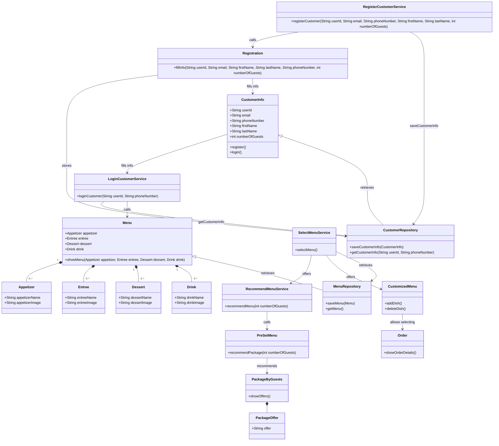

# INFO-6150-Final-Project


### Anqi


这个类图描述了一个餐厅管理系统的基本结构和功能。系统包括多个核心类和服务，每个类负责不同的功能和数据管理：

### 类介绍：

1. **CustomerInfo**: 保存客户的基本信息，如用户ID、电子邮件、电话号码、姓名等，并提供注册和登录方法。

2. **Registration**: 负责处理客户信息的填写和注册，将填写好的信息存储到 `CustomerRepository` 中。

3. **Menu**: 包含了各种菜单项，如开胃菜、主菜、甜点和饮料，可以展示整体菜单内容。

4. **Appetizer, Entree, Dessert, Drink**: 分别代表不同类型的菜单项，包含名称和图片等属性。

5. **PreSetMenu**: 提供预设的套餐推荐功能，根据客人数量推荐适合的菜单套餐。

6. **CustomizedMenu**: 允许客户自定义菜单，可以添加或删除菜品，与 `Order` 类协作允许选择菜品。

7. **Order**: 处理订单详细信息，可以显示订单内容。

8. **PackageByGuests**: 根据客人数量展示不同的优惠套餐。

9. **PackageOffer**: 描述套餐优惠的具体信息。

10. **RegisterCustomerService**: 提供注册客户的服务，调用 `Registration` 和 `CustomerRepository` 进行客户信息的注册保存。

11. **LoginCustomerService**: 提供客户登录验证的服务，调用 `CustomerRepository` 获取客户信息，并可能与 `Menu` 交互。

12. **RecommendMenuService**: 根据客人数量推荐菜单，调用 `PreSetMenu` 提供的推荐功能。

13. **SelectMenuService**: 提供菜单选择的服务，可以根据需要调用 `RecommendMenuService`、`CustomizedMenu` 和 `MenuRepository`。

14. **CustomerRepository**: 负责保存和获取客户信息的数据存储服务。

15. **MenuRepository**: 负责保存和获取菜单信息的数据存储服务。

### 关联和依赖关系：

- `Registration` 类依赖于 `CustomerRepository` 来保存客户信息。
- `CustomerInfo` 与 `LoginCustomerService` 之间存在填充信息的依赖关系。
- `SelectMenuService` 通过 `RecommendMenuService` 和 `CustomizedMenu` 提供菜单选择服务。
- 数据存储由 `CustomerRepository` 和 `MenuRepository` 负责。

### 功能说明：

这个系统允许客户注册并填写个人信息，登录后可以根据推荐或自定义选择菜单。预设菜单和定制菜单功能帮助客户根据需要选择合适的菜品。系统设计使得客户信息和菜单管理分离，同时提供了灵活的菜单推荐和定制功能，以满足不同客户的需求和喜好。

这种结构和功能的设计能够有效地支持餐厅管理系统的日常运作和客户服务。

### Class Diagram Overview:
The class diagram represents a comprehensive structure for a restaurant management system, encompassing various classes and services tailored for efficient operation and customer interaction.

### Core Classes and Their Functions:
**CustomerInfo**: Stores essential customer details such as user ID, email, phone number, first name, last name, and the number of guests. Provides methods for customer registration and login.

**Registration**: Manages the process of filling and storing customer information into the `CustomerRepository`.

**Menu**: Represents the menu of the restaurant, comprising appetizers, entrees, desserts, and drinks. Includes a method to display the menu items.

**Appetizer, Entree, Dessert, Drink**: Classes representing specific categories of menu items, each with attributes like name and image.

**PreSetMenu**: Offers predefined menu packages recommended based on the number of guests.

**CustomizedMenu**: Allows customers to customize their menu by adding or removing dishes. Collaborates with the `Order` class to finalize selections.

**Order**: Manages detailed order information, facilitating the display of order details.

**PackageByGuests**: Provides offers and packages tailored to the number of guests dining.

**PackageOffer**: Describes specific details of package offers.

**RegisterCustomerService**: Facilitates customer registration by calling the `Registration` class and saving customer information using `CustomerRepository`.

**LoginCustomerService**: Handles customer login functionality, retrieving customer information from `CustomerRepository` and potentially interacting with the Menu.

**RecommendMenuService**: Recommends menus based on the number of guests, utilizing methods from `PreSetMenu`.

**SelectMenuService**: Offers services for selecting menus, possibly interacting with `RecommendMenuService`, `CustomizedMenu`, and `MenuRepository` as needed.

**CustomerRepository**: Manages the storage and retrieval of customer information.

**MenuRepository**: Handles the storage and retrieval of menu items.

### Relationships and Dependencies:
**Dependency**: Registration relies on `CustomerRepository` to store customer information.
**Data Interaction**: CustomerInfo interacts with `LoginCustomerService` for filling in customer details.
**Service Interactions**: SelectMenuService collaborates with RecommendMenuService and CustomizedMenu to provide menu selection capabilities.
**Data Management**: `CustomerRepository` and `MenuRepository` ensure efficient data storage and retrieval for customer and menu information.


### Functionality Overview:

This system allows customers to register and log in, with their details stored securely. They can then select from recommended or customized menus, benefiting from tailored offers based on group size. The separation of customer and menu management ensures flexibility and efficiency in restaurant operations, supporting a seamless customer experience.

This design is structured to meet the operational needs of a restaurant, providing robust functionality for managing customer interactions and menu offerings effectively.


### Zui
``````mermaid

classDiagram 
    class Customer { 
        +String name 
        +String phoneNumber 
        +int numberOfGuests 
        +register() 
        +login() }

    class Registration {
        +fillInfo(name, phoneNumber, numberOfGuests)
    }

    class Menu {
        +showMenu()
    }

    class PreSetMenu {
        +recommendPackage(numberOfGuests)
    }

    class CustomMenu {
        +selectDishes()
    }

    class CustomerInfo {
        +String name
        +String phoneNumber
        +int numberOfGuests
    }

    class RegisterCustomerService {
        +registerCustomer(name, phoneNumber, numberOfGuests)
    }

    class LoginCustomerService {
        +loginCustomer(name, phoneNumber)
    }

    class RecommendMenuService {
        +recommendMenu(numberOfGuests)
    }

    class SelectMenuService {
        +selectMenu()
    }

    class CustomerRepository {
        +saveCustomerInfo(CustomerInfo)
        +getCustomerInfo(name, phoneNumber)
    }

    class MenuRepository {
        +saveMenu(Menu)
        +getMenu()
    }

    Customer --> Registration : fills info
    Registration --> CustomerInfo : stores
    Customer --> Menu : logs in
    Menu --> PreSetMenu : offers
    Menu --> CustomMenu : offers
    PreSetMenu --> PackageByGuests : recommends
    CustomMenu --> Dishes : allows selecting

    RegisterCustomerService --> Registration : calls
    LoginCustomerService --> Menu : calls
    RecommendMenuService --> PreSetMenu : calls
    SelectMenuService --> CustomMenu : calls

    CustomerRepository --> CustomerInfo : stores
    MenuRepository --> Menu : stores
``````

 逻辑介绍

以下是该类图中各个类及其交互的逻辑介绍：

 顾客注册和信息填写

1. **Customer** 类表示顾客，包含顾客的基本信息（姓名、电话号码、用餐人数）和方法（register()和login()）。
2. 顾客通过 **RegisterCustomerService** 类的 `registerCustomer(name, phoneNumber, numberOfGuests)` 方法注册。
3. **RegisterCustomerService** 调用 **Registration** 类的 `fillInfo(name, phoneNumber, numberOfGuests)` 方法，填写顾客信息。
4. **Registration** 类将填写的信息存储在 **CustomerInfo** 类中。
5. **CustomerRepository** 负责将 **CustomerInfo** 保存到数据库中。

 顾客登录和菜单展示

1. 顾客通过 **LoginCustomerService** 类的 `loginCustomer(name, phoneNumber)` 方法登录。
2. **LoginCustomerService** 调用 **Menu** 类的 `showMenu()` 方法展示菜单。
3. **MenuRepository** 负责从数据库中获取菜单数据。

 菜单推荐和选择

1. **Menu** 类提供两种菜单选项：预设菜单（PreSetMenu）和自定义菜单（CustomMenu）。
2. **PreSetMenu** 类根据顾客的用餐人数推荐套餐，通过 `recommendPackage(numberOfGuests)` 方法。
3. **CustomMenu** 类允许顾客通过 `selectDishes()` 方法自由选择菜品。
4. **RecommendMenuService** 类调用 **PreSetMenu** 类的 `recommendPackage(numberOfGuests)` 方法。
5. **SelectMenuService** 类调用 **CustomMenu** 类的 `selectDishes()` 方法。
6. **MenuRepository** 负责保存和获取菜单数据。


 Logical Explanation

Here is the logical explanation of the classes and their interactions in this class diagram:

 Customer Registration and Information Filling

1. **Customer** class represents the customer, containing basic information (name, phone number, number of guests) and methods (register() and login()).
2. The customer registers through the `registerCustomer(name, phoneNumber, numberOfGuests)` method of the **RegisterCustomerService** class.
3. **RegisterCustomerService** calls the `fillInfo(name, phoneNumber, numberOfGuests)` method of the **Registration** class to fill in customer information.
4. **Registration** class stores the filled information in the **CustomerInfo** class.
5. **CustomerRepository** is responsible for saving **CustomerInfo** to the database.

 Customer Login and Menu Display

1. The customer logs in through the `loginCustomer(name, phoneNumber)` method of the **LoginCustomerService** class.
2. **LoginCustomerService** calls the `showMenu()` method of the **Menu** class to display the menu.
3. **MenuRepository** is responsible for fetching menu data from the database.

 Menu Recommendation and Selection

1. **Menu** class offers two menu options: PreSetMenu and CustomMenu.
2. **PreSetMenu** class recommends packages based on the number of guests through the `recommendPackage(numberOfGuests)` method.
3. **CustomMenu** class allows the customer to freely select dishes through the `selectDishes()` method.
4. **RecommendMenuService** class calls the `recommendPackage(numberOfGuests)` method of the **PreSetMenu** class.
5. **SelectMenuService** class calls the `selectDishes()` method of the **CustomMenu** class.
6. **MenuRepository** is responsible for saving and fetching menu data.

